# budget-tracker

An **open-source, self-hosted personal-finance web app** you run on your own hosting, under your own
control. It links your real bank, credit, loan, and investment accounts through **Plaid**, tracks net
worth, spending, budgets, bills, goals, retirement and more, and adds optional insights from
free/paid data feeds (economic data, security prices, dividends, home value) and an optional
**Claude**-powered assistant.

It supports a **household of one or more people** — each signed-in user links their own accounts, and a
per-account visibility model (shared / private / hidden) controls what household members see of each
other. Your data lives only in your own database; nothing is sent to any service the app doesn't
explicitly call.

---

## ✨ Your whole financial life — self-hosted

> **Budget Tracker** is a self-hosted personal-finance dashboard for your whole household. Securely
> link your banks, cards, loans, and brokerages through **Plaid** and see net worth, cash flow,
> spending trends, budgets, upcoming bills, investments, and retirement projections — in one fast,
> mobile-first app that runs on **your own hosting**, with your data in **your own database**. Add
> free feeds for security prices, dividends, home value, and economic data, and ask an optional
> **Claude**-powered assistant questions in plain English. No subscriptions, no data harvesting —
> you own all of it.

  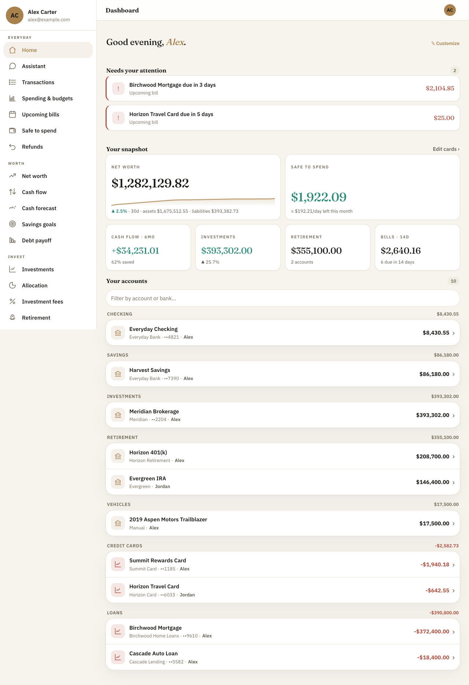

  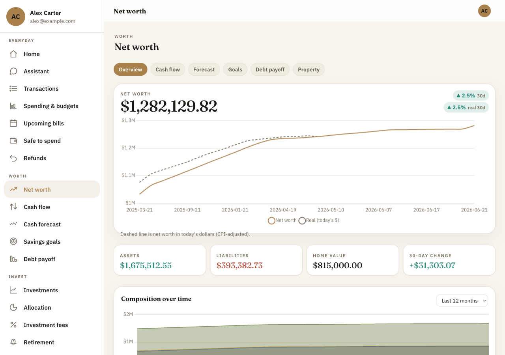
  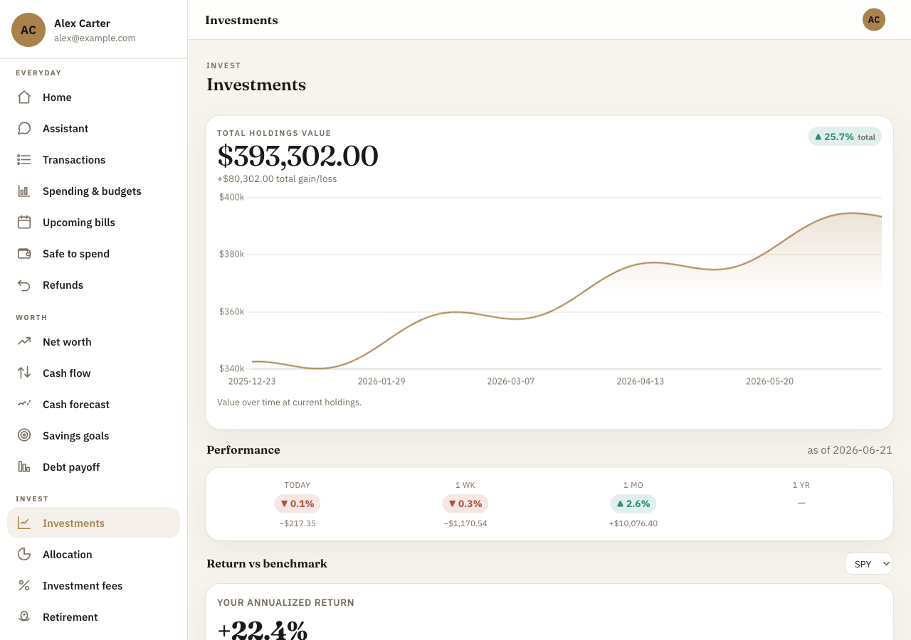
  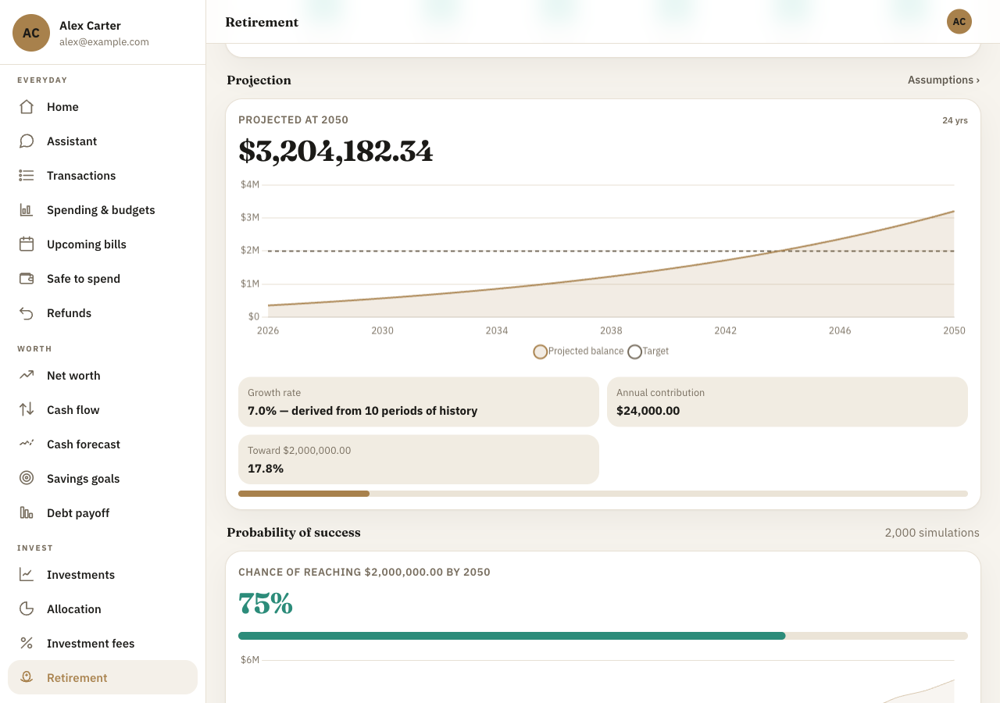

  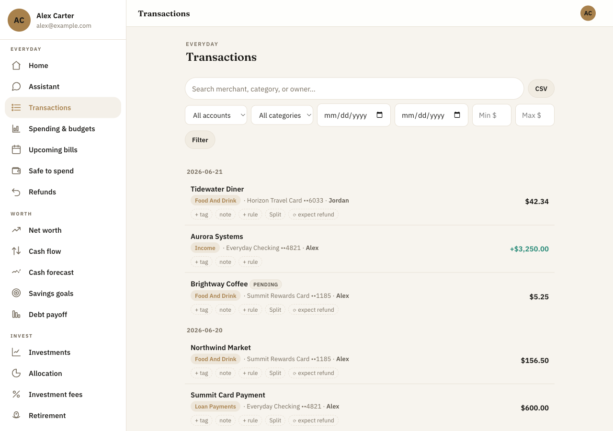
  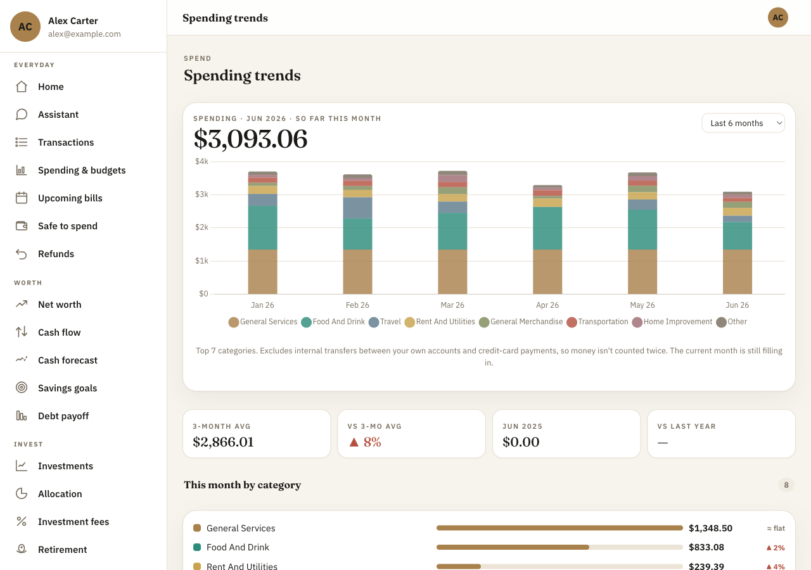
  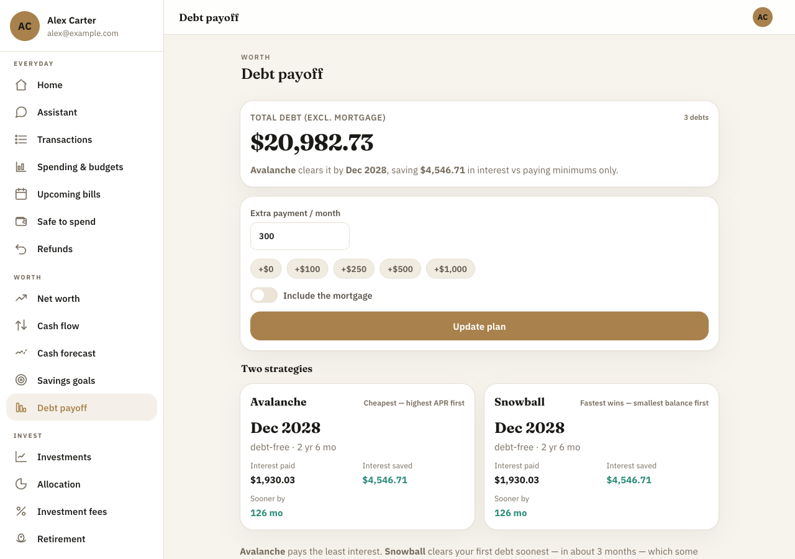

  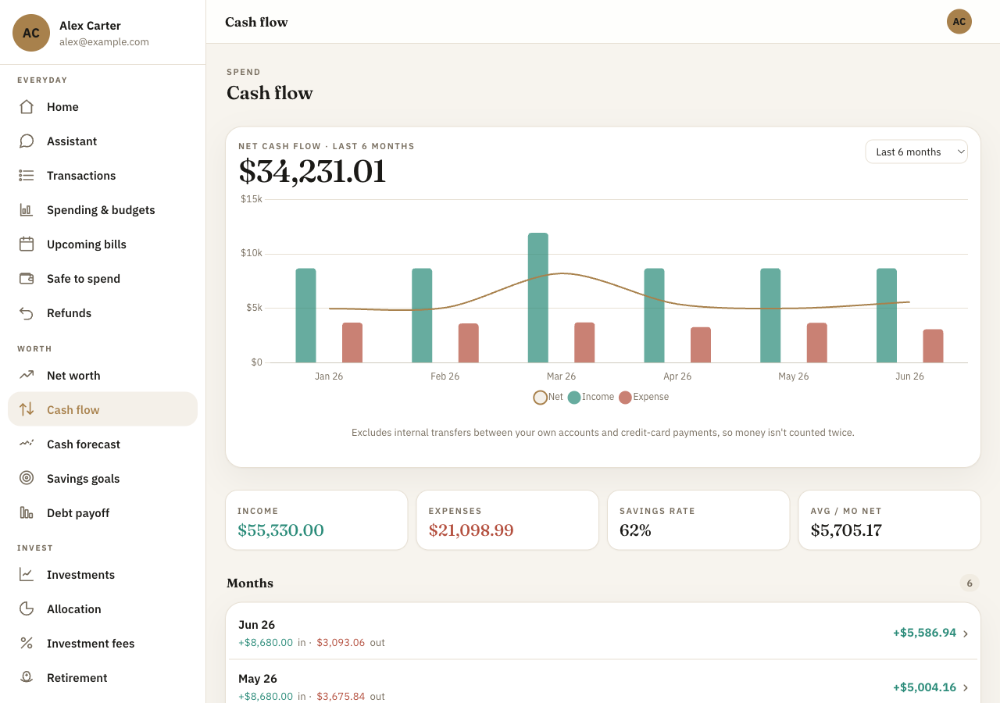
  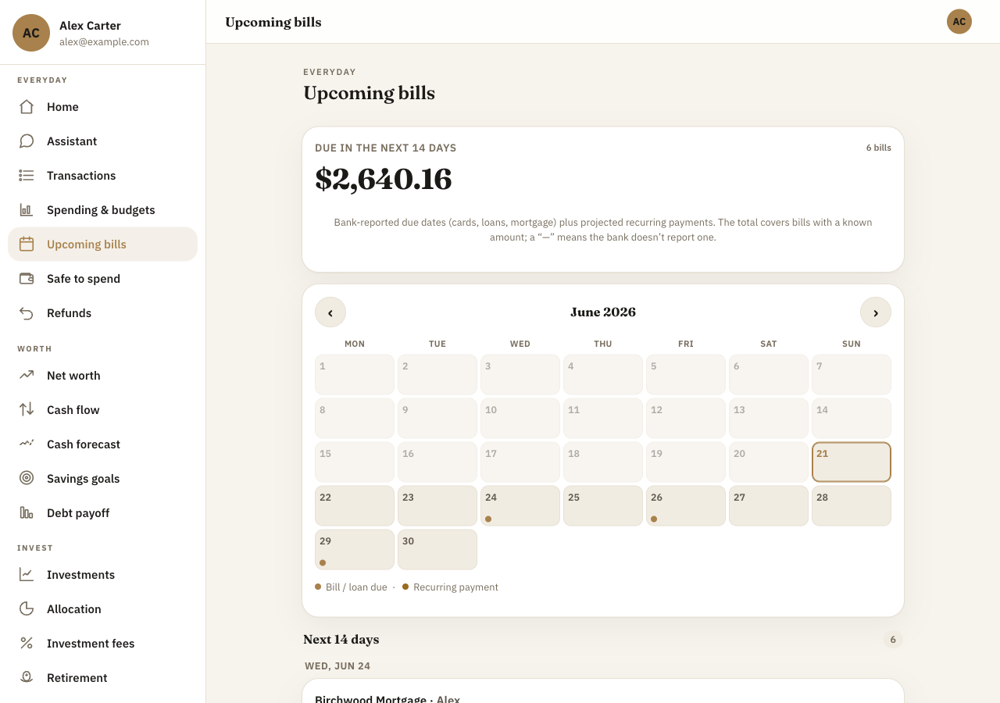
  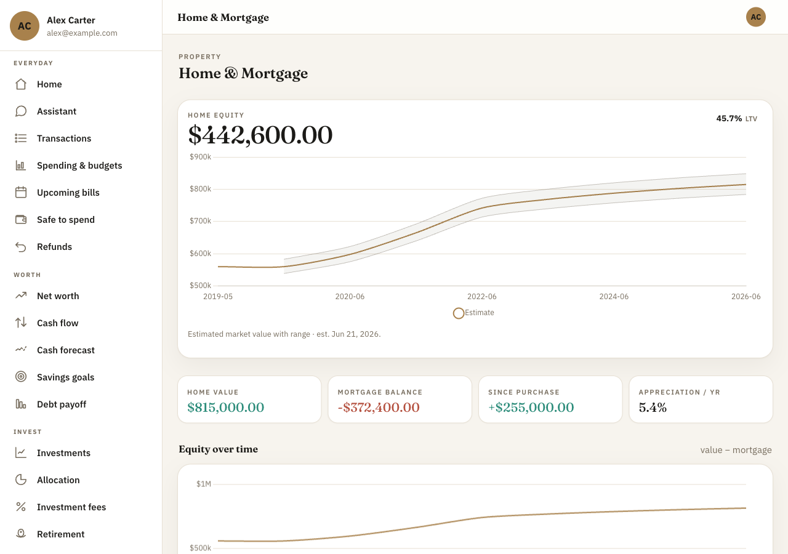

  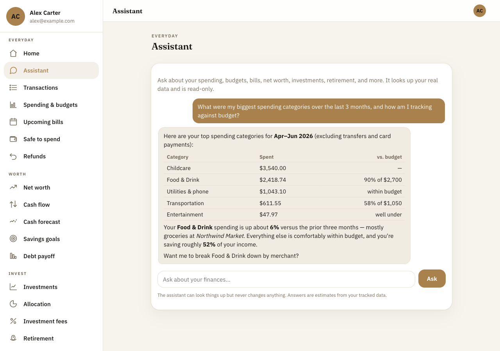

  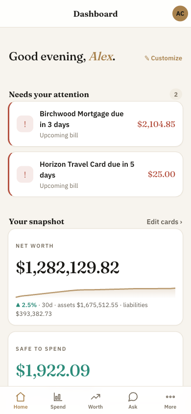
  &nbsp;&nbsp;
  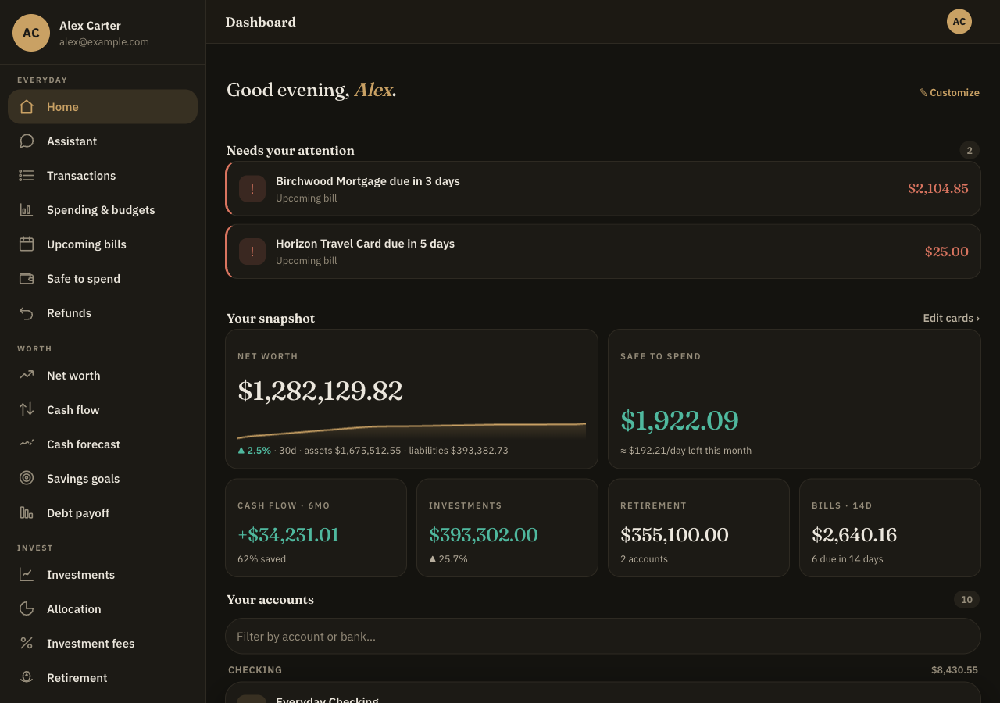

<em>Mobile-first · automatic light &amp; dark themes · your data, your server.</em>

### Highlights
- 📊 **Net worth & cash flow** over time, with inflation-adjusted (real) net worth
- 💸 **Spending** trends, budgets (with rollover), top merchants, money-flow Sankey, custom categories & rules
- 📅 **Plan ahead**: bills calendar, safe-to-spend, cash-flow forecast, refund tracking, savings goals
- 📈 **Investments**: holdings, money-weighted returns vs an index, allocation & drift, fee analyzer, dividend calendar
- 🏦 **Retirement**: contribution tracking + projection with a Monte Carlo "probability of success"
- 🏠 **Home & debt**: home value vs mortgage, equity, and a snowball-vs-avalanche debt-payoff planner
- 🤖 **Optional AI assistant** (Claude) — ask about your finances in plain English (read-only)
- 👫 **Household-friendly**: multiple users, per-account privacy (shared / private / hidden), admin roles
- 🔒 **Yours**: self-hosted PHP + MySQL, Plaid-secured tokens encrypted at rest, no subscriptions, no tracking

### 📚 Documentation
**Install:** [Full guide](docs/INSTRUCTIONS.md) · [Overview & shopping list](docs/install/00-overview.md) · [Hosting](docs/install/10-hosting-sureserver.md) · [Config & secrets](docs/install/30-config-and-secrets.md)
**Connect:** [Google sign-in](docs/install/services/google-oauth.md) · [Plaid](docs/install/services/plaid.md) · [Optional data feeds](docs/install/services/)
**Run it:** [Verify & first run](docs/install/60-verify.md) · [Users, roles & admin](docs/install/70-users-and-admin.md) · [Troubleshooting](docs/install/troubleshooting.md)

Screenshots use fictional demo data (the "Carter household") — not real accounts.

---

- **Stack:** PHP 8.3 + MySQL 8 + Plaid. No framework, **no build step**, server-rendered, mobile-first.
- **Hosting:** designed for **any cPanel-based hosting provider** with PHP 8.3 + MySQL 8, SSH or File
  Manager, and cron. The app itself is plain PHP and will run on any PHP 8.3 + MySQL 8 host.
  > **All testing was done using [https://www.icdsoft.com](https://www.icdsoft.com)** (whose servers
  > are backed by **sureserver / SureSupport** — so any sureserver-hosted reference in these docs refers
  > to the same ICDSoft infrastructure).
- **Sign-in:** Google OAuth, restricted to an allow-list of email addresses you control.

---

## 📦 Install it

**👉 Full step-by-step installation guide: [`docs/INSTRUCTIONS.md`](docs/INSTRUCTIONS.md)**

That guide walks a brand-new person through standing up their **own** complete instance from
scratch — their own hosting account, subdomain, database, and their own third-party service
accounts. It offers **two tracks**:

1. **Guided installer** — run [`tools/install.sh`](tools/install.sh); it asks a few questions and
   drives the sureserver Control Panel API to create the subdomain, database, PHP runtime, cron job,
   and config file for you.
2. **Manual setup** — click through the hosting control panel and each third-party console yourself,
   following the illustrated subpages.

Every external service you might use is documented as its own walkthrough, clearly labelled
**REQUIRED**, **OPTIONAL · FREE**, or **OPTIONAL · PAID**, so you can install only what you want.

| You will need | Why | Cost |
|---|---|---|
| A **cPanel-based** hosting account (PHP 8.3 / MySQL 8) — e.g. [ICDSoft](https://www.icdsoft.com), where it was tested | Runs the app | Paid hosting plan |
| A registered **domain** | The address you sign in at | ~$10–15/yr |
| A **Google Cloud** OAuth client | Sign-in | Free |
| A **Plaid** account | Bank/credit/investment data | Free trial (up to 10 linked banks) |
| *(optional)* Twelve Data, FRED, Polygon, RentCast, Anthropic keys | Extra insights | Free / pay-as-you-go |

Start at **[`docs/INSTRUCTIONS.md`](docs/INSTRUCTIONS.md)**.

---

## 🗂 Repository layout

| Path | What |
|---|---|
| `www/` | The application (this is what gets deployed to your web root) |
| `www/lib/config.sample.php` | Template for your secrets/config — copy to `www/lib/config.php` |
| `www/lib/schema.sql` | The complete MySQL schema (apply once on a fresh install) |
| `www/lib/migrations/` | Incremental schema upgrades (only needed when **upgrading** an existing DB) |
| `www/cron/sync.php` | Nightly sync job (run via a cron entry) |
| `docs/INSTRUCTIONS.md` + `docs/install/` | **The installation guide** and its subpages |
| `tools/install.sh` | The guided installer (POSIX shell + curl) |
| `deploy.sh.example` | Template one-command rsync deploy — copy to `deploy.sh` and fill in your host/key/db (your real `deploy.sh` is git-ignored) |

> The database schema is documented in [`docs/schema.sql`](docs/schema.sql); the application code
> under `www/` is the source of truth for behavior.

---

## 🔐 Security notes for installers

- **Your secrets never go in git.** `www/lib/config.php`, `docs/CREDENTIALS.local.md`, and `*.png`
  are git-ignored. Keep them that way.
- The app encrypts Plaid access tokens at rest with a key **you** generate (`encryption_key`).
  Losing that key means re-linking every bank — back it up.
- Sign-in is limited to people an administrator has invited (managed in **Settings → Users &
  access**). On a fresh install the first Google account to sign in becomes the admin; everyone else
  is rejected unless invited. A `config.php` `allowed_emails` list acts as a break-glass admin so you
  can't lock yourself out. See [`docs/install/70-users-and-admin.md`](docs/install/70-users-and-admin.md).

## License / use

Released under the **[MIT License](LICENSE)** — free to use, modify, and distribute, provided
**as-is with no warranty**. You self-host your own instance and are responsible for your own API
keys, hosting costs, and the financial data you connect. It is not affiliated with Plaid, Google, or
any other service it integrates with.

**Forking vs. contributing:** forks for your own personal use and adjustments are welcome, but this
repo does **not** accept direct contributions (pull requests won't be merged). See
**[CONTRIBUTING.md](CONTRIBUTING.md)**.
